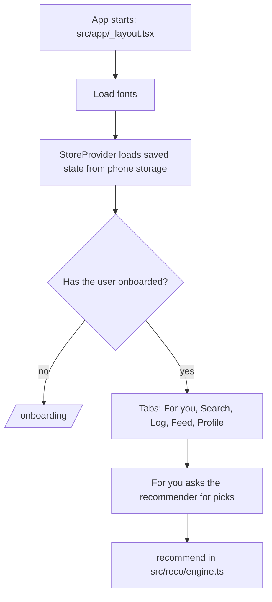
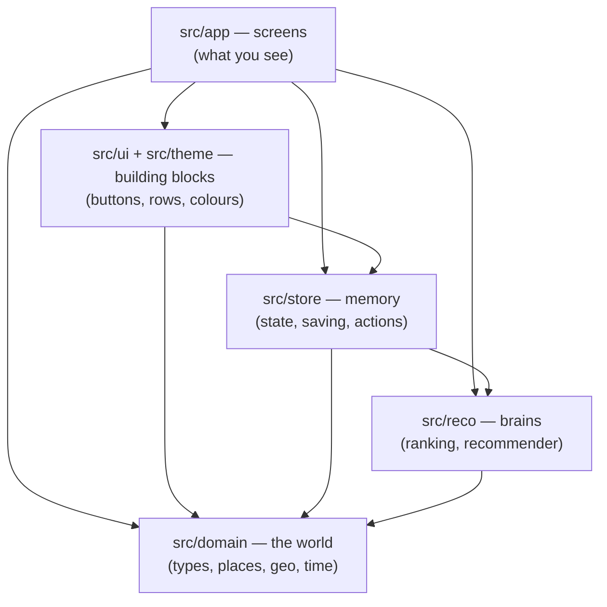

# How Thoq works

A guided tour of the codebase for someone who wants to understand it, not just run it. Read it top to bottom once; after that, use the [file-by-file reference](#8-every-file-explained) when you're in a specific file.

**Contents**

1. [The 60-second version](#1-the-60-second-version)
2. [The tools, and why each one is here](#2-the-tools-and-why-each-one-is-here)
3. [Running it](#3-running-it)
4. [The folder map](#4-the-folder-map)
5. [The core ideas (product vocabulary)](#5-the-core-ideas-product-vocabulary)
6. [The architecture: five layers](#6-the-architecture-five-layers)
7. [Follow one action end to end: logging a visit](#7-follow-one-action-end-to-end-logging-a-visit)
8. [Every file explained](#8-every-file-explained)
9. [Deep dive: how scores are made (ranking)](#9-deep-dive-how-scores-are-made-ranking)
10. [Deep dive: how recommendations are made](#10-deep-dive-how-recommendations-are-made)
11. [Deep dive: state, saving and loading](#11-deep-dive-state-saving-and-loading)
12. [The design system](#12-the-design-system)
13. [Tests](#13-tests)
14. [What's real and what's fake](#14-whats-real-and-whats-fake)
15. [Recipes: how to change common things](#15-recipes-how-to-change-common-things)
16. [Glossary](#16-glossary)

---

## 1. The 60-second version

Thoq is a **mobile app** written in **TypeScript** using **React Native** (via **Expo**). The same code runs on iPhone, Android and in a web browser.

Everything currently runs **on the device**. There is no server yet:

- The **places** (36 fictional cafés and restaurants in Riyadh) are a list hard-coded in `src/domain/seed-places.ts`.
- The **community** (12 fictional people with visits, scores and lists) is generated by code in `src/domain/seed-community.ts`, the same way every time.
- **Your** data (your rankings, visits, lists, who you follow) is kept in one JavaScript object called `state`. It's saved to the phone's storage after every change and loaded back when the app opens.

When you open the app, this happens:



Two pieces of logic make Thoq *Thoq*, and both are plain TypeScript with no UI attached:

| Piece | File | What it does |
| --- | --- | --- |
| **Ranking** | `src/reco/ranking.ts` | Turns "Loved it" plus a few "which would you rather go back to?" answers into a score out of 10. |
| **Recommender** | `src/reco/engine.ts` | Decides which places to show you, in what order, and writes the reasons. |

Everything else is screens, storage and styling around those two.

---

## 2. The tools, and why each one is here

You'll see these names everywhere. Here is what each one actually is.

| Tool | What it is | Why Thoq uses it |
| --- | --- | --- |
| **TypeScript** | JavaScript with types. You declare what shape data has (`place.price` is a number from 1 to 4), and the compiler catches mistakes before the app runs. | Most bugs in an app like this are "I passed the wrong thing". Types catch those for free. |
| **React** | A way to build UI as **components**: functions that take data (*props*) and return what should be on screen. When data changes, React re-renders what changed. | The standard for building app UIs. |
| **React Native** | React, but instead of HTML `<div>`s it draws real native views on iOS and Android. You write `<View>`, `<Text>`, `<Pressable>` instead of `<div>`, `<p>`, `<button>`. | One codebase for iOS and Android. |
| **react-native-web** | Translates those native views into HTML so the same app runs in a browser. | Lets us test screens in a browser, and gives Thoq a web version for free. |
| **Expo** (SDK 57) | A toolkit on top of React Native: build tools, a dev server, and ready-made modules (location, fonts, splash screen…). | Removes most of the pain of native builds. You never touch Xcode or Android Studio directly. |
| **Expo Go** | An app you install on your phone that runs your project by scanning a QR code. | Fastest way to see changes on a real phone. |
| **Expo Router** | File-based navigation: **every file in `src/app/` is a screen**, and its path is its URL. `src/app/place/[id].tsx` is the screen at `/place/nabta`. | No navigation config to maintain. The folder *is* the map of the app. |
| **React Compiler** | Turned on in `app.json` (`"reactCompiler": true`). It automatically adds performance optimisations (memoisation) that you'd otherwise write by hand. | Less boilerplate, and screens stay fast. |
| **AsyncStorage** | A simple key-value store on the device. | Where your state is saved between app launches. |
| **expo-location** | Asks permission and reads the phone's GPS. | "Use my location" in onboarding and For you. |
| **Google Fonts packages** (`@expo-google-fonts/*`) | Font files bundled into the app. | Newsreader, IBM Plex Sans and IBM Plex Mono. See [the design system](#12-the-design-system). |
| **Vitest** | A test runner. You write `expect(x).toBe(y)` and it tells you if it's true. | Tests the ranking and recommender maths automatically. |
| **ESLint** | Checks code for likely mistakes and rule violations (e.g. using a React hook in the wrong place). | `npm run lint`. |

**Two words you'll see constantly:**

- **Hook**: a function whose name starts with `use` (e.g. `useState`, `useStore`, `usePalette`). Hooks let a component remember things or read shared data. Rule: only call them at the top of a component, never inside `if` or loops.
- **Props**: the inputs to a component. In `<Score value={8.4} size="lg" />`, `value` and `size` are props.

---

## 3. Running it

```bash
npm install        # download all dependencies into node_modules/
npm start          # start the Expo dev server; scan the QR code with Expo Go, or press w for web
npm test           # run the unit tests (vitest)
npm run typecheck  # check TypeScript types (tsc --noEmit)
npm run lint       # run ESLint
npm run build:web  # build a static web version into dist/
```

Run `npm test`, `npm run typecheck` and `npm run lint` before every commit. If all three pass, you're very unlikely to have broken anything structural.

**On Windows:** use a 64-bit Node.js (check with `node -p "process.arch"`; it must print `x64` or `arm64`). The web bundler has no 32-bit Windows build.

---

## 4. The folder map

```
thoq/
├── src/                        ← all app code
│   ├── app/                    ← SCREENS. Every file here is a route (a URL / page)
│   │   ├── _layout.tsx         ← root wrapper: fonts, saved state, the screen stack
│   │   ├── (tabs)/             ← the five bottom tabs. (Brackets = "group, not part of the URL")
│   │   │   ├── _layout.tsx     ← the tab bar itself + "go to onboarding if new"
│   │   │   ├── index.tsx       ← For you            → /
│   │   │   ├── search.tsx      ← Search             → /search
│   │   │   ├── log.tsx         ← Log a visit        → /log
│   │   │   ├── feed.tsx        ← Feed               → /feed
│   │   │   └── profile.tsx     ← Profile            → /profile
│   │   ├── onboarding.tsx      ← first-run setup    → /onboarding
│   │   ├── compare.tsx         ← "which would you rather go back to?" → /compare
│   │   ├── place/[id].tsx      ← a place            → /place/nabta
│   │   ├── user/[id].tsx       ← another person     → /user/u-nora
│   │   ├── list/[id].tsx       ← a list             → /list/l-nora-filter (or /list/want)
│   │   ├── list/new.tsx        ← create a list      → /list/new
│   │   ├── list/add/[id].tsx   ← add places to a list → /list/add/<listId>
│   │   └── save/[id].tsx       ← add one place to your lists → /save/<placeId>
│   │
│   ├── domain/                 ← THE WORLD: what a place/visit/user is, plus the fake data
│   │   ├── types.ts            ← the data shapes (Place, Visit, User, PlaceList…)
│   │   ├── vocabulary.ts       ← taste tags, Riyadh neighbourhoods, price labels
│   │   ├── seed-places.ts      ← the 36 fictional places
│   │   ├── seed-community.ts   ← generates the 12 fictional people and their activity
│   │   ├── geo.ts              ← distance, opening hours, Riyadh time
│   │   ├── clock.ts            ← date formatting and calendar helpers
│   │   └── origin.ts           ← turns GPS coordinates into "near Al Malqa"
│   │
│   ├── reco/                   ← THE BRAINS: pure maths, no UI
│   │   ├── ranking.ts          ← scores from comparisons
│   │   └── engine.ts           ← the recommender
│   │
│   ├── store/                  ← THE MEMORY: the app's state and how it changes
│   │   ├── state.ts            ← state shape + reducer (every possible change)
│   │   ├── provider.tsx        ← makes state available to every screen; saves/loads it
│   │   └── locate.ts           ← asks for GPS location
│   │
│   ├── ui/                     ← REUSABLE PIECES of interface
│   │   ├── primitives.tsx      ← Txt, Button, Choice, Screen, Score, Panel…
│   │   ├── place-row.tsx       ← the one list row used for places everywhere
│   │   ├── calendar.tsx        ← the month grid on the Log screen
│   │   └── origin-picker.tsx   ← "Use my location" / pick a neighbourhood
│   │
│   └── theme/                  ← THE LOOK
│       ├── tokens.ts           ← colours, spacing, font sizes
│       └── use-palette.ts      ← picks light or dark colours
│
├── assets/images/              ← app icon, splash screen, favicon
├── data-tools/                 ← Python scripts to audit real place datasets (see its README)
├── docs/HOW-IT-WORKS.md        ← this file
├── app.json                    ← Expo config: app name, icon, permissions, plugins
├── package.json                ← dependencies and npm scripts
├── tsconfig.json               ← TypeScript settings (incl. the "@/..." import shortcut)
├── eslint.config.js            ← lint rules (Expo's defaults)
├── vitest.config.ts            ← which files are tests
├── AGENTS.md / CLAUDE.md       ← rules for AI assistants working on this repo (design + product rules live here)
└── README.md                   ← short overview
```

**Files ending in `.test.ts`** sit next to the code they test (e.g. `ranking.test.ts` tests `ranking.ts`).

**`.ts` vs `.tsx`:** `.tsx` files contain JSX, the `<Tag>`-style UI syntax. `.ts` files are pure logic.

**`@/` in imports** (e.g. `import { useStore } from '@/store/provider'`) is a shortcut for `src/`, set up in `tsconfig.json`. It saves writing `../../../store/provider`.

**Not in git** (see `.gitignore`): `node_modules/` (downloaded dependencies), `.expo/` (caches), `dist/` (web builds), `ios/` and `android/` (generated by Expo when you make native builds; never edit them by hand).

---

## 5. The core ideas (product vocabulary)

Before the code makes sense, the concepts need to.

| Concept | Meaning | Where it lives |
| --- | --- | --- |
| **Place** | A café or restaurant. Has a `kind` (`'cafe'` or `'restaurant'`), area, coordinates, price level 1–4, opening hours, **tags** and a short menu. | `types.ts`, data in `seed-places.ts` |
| **Tag** | A taste feature like `pour-over`, `quiet`, `saudi`, `family`. Places have tags; your taste is a weight per tag. This shared vocabulary is what lets the recommender compare you to a place. | `vocabulary.ts` |
| **Reaction** | Your gut answer after a visit: `loved`, `fine` or `disliked`. It picks the score range. | `types.ts` |
| **Ranking** | Your places of one kind, in order, best first. Cafés and restaurants are ranked separately. | `state.rankings` |
| **Score** | A number 0–10 **calculated from your place's position in your ranking**. It's never typed in. | `ranking.ts` → `scoresOf()` |
| **Visit** | One logged trip: place, date, reaction, what you had, note. A place can have many visits. | `state.visits` |
| **Unranked** | Places you said you've been to during onboarding but haven't put in order yet. They teach the recommender immediately (with a provisional score) and get ranked later in batches. | `state.unranked` |
| **Want to go** | Your saved-for-later places. Logging a visit removes the place from it. | `state.wantToGo` |
| **List** | A named, ordered collection of places ("Filter coffee spots"). | `state.lists` |
| **Following** | People whose activity appears in Feed → Following. | `state.following` |
| **Origin** | Where distance is measured from: your GPS location, or a neighbourhood you picked. | `state.origin` |
| **Community average** | The mean of everyone's scores for a place. **The only "place number" users see** besides their own score. | `provider.tsx` → `crowd` |
| **Taste match** | How much your scores agree with another person's. **Backend only.** Users only ever see a label: "Similar taste" / "Very similar taste". | `engine.ts` → `agreement()`, `tasteLabel()` |

**Product rule worth memorising:** a number out of 10 on screen is always a *real* score (yours, or the community average). Predictions and match percentages are used to decide order and write reasons, but are never displayed.

---

## 6. The architecture: five layers

The code is split into layers. **Each layer may only use the layers below it.**



Why bother?

- **`reco/`, `domain/` and `store/state.ts` contain no React and no storage.** They are plain functions: data in, data out. That makes them easy to test (54 tests run in under a second), and they can move to a server later **without changes**. When Thoq gets a backend, `recommend()` will run there instead of on the phone.
- **Screens stay thin.** A screen mostly reads data, calls a function from `reco/`, and arranges building blocks from `ui/`.
- **Changing the look never risks the maths**, and vice versa.

---

## 7. Follow one action end to end: logging a visit

The best way to understand an app is to trace one action all the way through. You log a visit to Ghaf Roasters and say you loved it.

**1. You fill in the form** (`src/app/(tabs)/log.tsx`).
The screen keeps your in-progress answers in local component state: `useState` for `placeId`, `reaction`, `date`, `ordered`, `note`. Nothing is saved yet.

**2. You tap "Save and compare".**
`save()` builds a visit object and sends an **action** to the store:

```ts
dispatch({ type: 'log', visit: { placeId: 'ghaf', reaction: 'loved', date, ordered, note } });
```

`dispatch` means "please apply this change". Screens never edit state directly; they describe what happened and let the reducer decide what that means.

**3. The reducer handles `'log'`** (`src/store/state.ts`).
A **reducer** is a function `(oldState, action) → newState`. For `'log'` it calls `begin()`, which:

- calls `startSession()` from `ranking.ts` to set up the comparison search over your *loved cafés*;
- if there's nothing to compare against (your first loved café), **commits immediately**: inserts Ghaf into your ranking and adds the visit;
- otherwise, stores a `pending` comparison in state and waits.

**4. The app moves to `/compare`** (`src/app/compare.tsx`).
The compare screen reads `state.pending`, asks `pivot()` "which place should I compare against?", and shows two options. Each tap dispatches `{ type: 'answer', answer: 'new' | 'existing' | 'tie' | 'skip' }`.

**5. Each answer narrows the search** (`answer()` in `ranking.ts`).
When the position is settled (or after 4 questions), the reducer **commits**: Ghaf is inserted into `state.rankings.cafe` at the right position, the visit is added to `state.visits`, Ghaf is removed from want-to-go, and `pending` is cleared.

**6. State changed, so two things happen automatically** (`src/store/provider.tsx`):

- the provider **recalculates derived data**: your scores (`scoresOf`), community averages, and so on;
- an effect **saves the new state** to AsyncStorage.

**7. Every screen that reads the store re-renders.**
The compare screen sees `pending` is gone and navigates to `/place/ghaf?ranked=1`, which shows "Ranked #2 of your 6 cafés at 9.3". For you now excludes Ghaf (you've been) and has learned a bit more about your taste, so its picks shift.

That loop is the entire app: **screen → dispatch(action) → reducer → new state → derived data → screens re-render → state saved**.

---

## 8. Every file explained

### Root files

| File | What it does |
| --- | --- |
| `package.json` | Lists dependencies (with versions) and the `npm` scripts. `"main": "expo-router/entry"` tells Expo to start from the router. |
| `package-lock.json` | Auto-generated. Pins the exact version of every dependency so every install is identical. Never edit by hand. |
| `app.json` | Expo configuration: app name, bundle IDs (`app.thoq`), icon and splash images, light/dark support, and **plugins**. The `expo-location` plugin entry sets the permission message iOS shows ("Thoq uses your location to show places near you…") and turns off background location. `"output": "single"` makes the web build a single-page app. |
| `tsconfig.json` | TypeScript settings. `strict: true` turns on the strictest checks. `paths` defines the `@/` shortcut. |
| `eslint.config.js` | Uses Expo's recommended lint rules unchanged. |
| `vitest.config.ts` | Tells Vitest that tests are `src/**/*.test.ts`, running in Node (no phone needed). |
| `.gitignore` | Files git should never track (dependencies, caches, builds, secrets like `.env*.local`). |
| `AGENTS.md`, `CLAUDE.md` | Instructions for AI coding assistants. `AGENTS.md` holds the **design rules** and **product rules** (e.g. no prediction numbers on screen, no "Date night"). Worth reading yourself. `CLAUDE.md` just points to it. |
| `.claude/settings.json` | Enables the Expo plugin for Claude Code. Doesn't affect the app. |

### `src/app/`: the screens

Expo Router turns this folder into the app's navigation:

- A file is a screen; its path is its URL.
- `_layout.tsx` wraps every screen in its folder (and sub-folders).
- `(tabs)` in brackets is a **group**: it shares a layout (the tab bar) without adding `/tabs` to URLs.
- `[id]` in brackets is a **dynamic segment**: `place/[id].tsx` handles `/place/anything`, and the screen reads the value with `useLocalSearchParams()`.

**`_layout.tsx` (root)** runs once when the app starts:

1. Keeps the splash screen up while three font families load (`useFonts`).
2. Wraps everything in `SafeAreaProvider` (so content avoids the notch and home bar) and `StoreProvider` (so every screen can use `useStore()`).
3. Declares a **Stack** navigator: screens slide on top of each other. `compare` is a full-screen modal you can't swipe away mid-comparison.

**`(tabs)/_layout.tsx`** defines the bottom tab bar:

- If you haven't onboarded, it immediately redirects to `/onboarding` (`<Redirect>`).
- It draws a **custom tab bar** (`TabBar`): text labels only, a clay line above the active tab, and "+ Log" as the one filled block.

**`(tabs)/index.tsx` (For you)**

- **Inputs:** `kind` (Coffee/Food/none), `when` (Now / Tonight / a chosen hour), "Within 5 km", Budget, and your origin.
- **Process:**
  - It turns those inputs into a `Context` object and calls `recommend()`.
  - "Now" means open now *or opening within 90 minutes* (`OPENING_SOON_MIN`), so a place opening at 20:00 can show at 19:30 as "Opens 20:00".
  - The first result is the **top pick**, drawn on a sand `Panel` with the sawtooth edge and its reasons.
  - The rest are `PlaceRow`s showing the community average.
- **Also:** if you have unranked places, a prompt offers "Rank 3", which opens `/compare?batch=3`.

**`(tabs)/search.tsx`**

- Matches your query against name, Arabic name, area, category, tag labels and menu items, ignoring case and accents. Every word must match something.
- Filters: Cafés/Restaurants toggles, Open now, and quick tags.
- Sorts by community average, distance or name.

**`(tabs)/log.tsx`**

- **Step 1, no place chosen yet:** a searchable place picker, with your want-to-go list first.
- **Step 2, place chosen:** numbered steps.
  1. The place.
  2. When: a date field that opens the `Calendar`, set to today by default; future dates are blocked.
  3. How was it: on a sand panel. The three reactions show their score ranges.
  4. What you had: the place's menu as chips, plus free text.
  5. Note: up to 280 characters.
- **Keying trick:** the outer `Log` component re-creates the form (`key={placeId}`) whenever another screen sends a new place. Tabs stay mounted, so without this the old answers would linger.

**`(tabs)/feed.tsx`**

- **For you** builds a list of **items**:
  - **Posts:** other people's visits *with a written note*. They're ranked by `2 × taste agreement + recency (e^(−days/21)) + 0.3 if you follow them`.
  - **Modules mixed in at fixed positions:** a **split decision** after the 3rd post (the place two people disagree on most, at least 4 points apart, on the coffee band), people with similar taste after the 7th, community lists after the 11th and 20th, and a second split decision after the 15th.
- **Following:** every visit from people you follow, newest first.
- A post leads with the **person** (initial, name, taste label), then the **review** in large serif type, then the place and their score.

**`(tabs)/profile.tsx`**

- **Stats:** one big number ("Places been") and three small ones.
- **Taste profile:** the top tag weights from `tasteVector()`, drawn as bars, plus the tags you steer away from.
- **Rankings:** per kind, with a "Been, not ranked yet" section and a "Rank 3" action.
- **Lists:** Want to go plus your own lists.
- **Diary:** your last 20 visits.
- **Reset:** "Reset all data" needs two taps to confirm.

**`onboarding.tsx`**: a 6-step flow kept in local state, dispatched once at the end as `{ type: 'onboard', ... }`.

1. **Sign in.** Phone by default; "Use email instead" swaps the field. The phone number is normalised to `+9665XXXXXXXX`. A 4-digit code step follows, **labelled as a prototype** because no SMS is actually sent.
2. **Name.**
3. **Location.** Uses `OriginPicker`: GPS first, with neighbourhoods as the fallback.
4. **Taste tags.** Each is a `TriChoice`: tap once for yes (+1), again for "not for me" (−1), again to clear. At least 3 yes answers are needed to continue.
5. **Budget.**
6. **Places you've been.** Search plus a Cafés/Restaurants filter; each row has Loved / Fine / Didn't like. There's no limit. These become `state.unranked`.

**`compare.tsx`**: the head-to-head question screen.

- **Normal mode:** answers questions for `state.pending`; when that finishes, it opens the place page.
- **Batch mode** (`?batch=3`): when nothing is pending, it starts the next unranked place (`rankNext`). It repeats until the batch count runs out, then goes back.
- **Answers:** "Too close to call" (tie) and "Not comparable" (skip). "Discard visit" / "Stop" cancels.

**`place/[id].tsx`**

- **Scores:** a 3:2 split, with the community average large on the left and your score on the right ("been, not ranked" / "not been yet" if you have none).
- **Rating spread:** horizontal bars.
- **Actions:** Log, Want to go, Add to a list.
- **"Why Thoq thinks you'd like it":** the recommender's reasons, shown only if you haven't been.
- **Details:** tags, most-ordered items, visits (with taste labels), and similar places (`similarPlaces()`).
- **After ranking:** `?ranked=1` shows the "Ranked #2 of your 6 cafés" banner.

**`user/[id].tsx`**: another person's profile.

- A taste label, or "Different taste from yours" / "Not enough in common yet".
- How many places you've both been to.
- "Where you differ": shared places sorted by the biggest score gap.
- Their rankings and their lists.

**`list/[id].tsx`**: a list.

- `id = 'want'` is a virtual list built from `state.wantToGo`.
- For your own lists: an "Add places" button and **"Suggested for this list"** (`suggestForList()`) with + buttons.
- Deleting a list needs two taps.

**`list/new.tsx`**: create a list. If opened with `?placeId=`, that place goes in first.

**`list/add/[id].tsx`**: Spotify-style adding: search with a + / ✓ toggle on every place, then "Done".

**`save/[id].tsx`**: the reverse direction: one place, toggle it in or out of each of your lists.

### `src/domain/`: the world

**`types.ts`** defines the main data shapes:

- **`Place`**: as described in [the core ideas](#5-the-core-ideas-product-vocabulary). `hours` is `{ open, close }` in **minutes after midnight**, so 07:00 is 420. When `close` is less than `open`, the place closes after midnight.
- **`Visit`**: `id`, `userId`, `placeId`, `date` (an ISO string `'2026-09-30'`), `reaction`, `ordered[]`, `note`.
- **`User`** and **`PlaceList`**.
- **`PriceLevel`**: 1 (under SAR 40) to 4 (SAR 180+).

**`vocabulary.ts`**

- `TAG_GROUPS`: the taste tags in four groups (Coffee & bakes, Food, Who you go with, The room). Onboarding shows exactly these.
- `TAG_LABEL`: tag id → display label.
- `AREAS`: 10 Riyadh neighbourhoods with coordinates.
- `PRICE_LABEL` and `PRICE_CAP`: price display text.

**`seed-places.ts`**: 36 fictional places.

- Each is created by the helper `p(...)`, which turns `'07:00'` into minutes and places it a small offset from its neighbourhood's centre.
- `PLACE_BY_ID` is a lookup table so code can do `PLACE_BY_ID['nabta']` instead of searching the list.

**`seed-community.ts`**: generates the fake community **deterministically**, so the same output appears every launch.

- **Personas:** 12 people, each with a taste persona (tag weights).
- **Randomness:** `mulberry32` is a tiny random-number generator that, given the same seed, produces the same "random" numbers every time. That makes the fake community stable and testable.
- **Each person's places:** the ones that best fit their taste, plus some noise, so everyone tries a few things outside their lane.
- **Each person's scores:**
  - `latent = 5.6 + 3.4 × tasteFit + quality + noise`, where `QUALITY` makes some places simply better than others.
  - Reactions come from thresholds: 6.8 and above is loved, 4.2 and above is fine.
- **Review notes:** assembled from opening lines (`LEADS`) plus tag-specific sentences (`TAG_LINES`).
- **Lists:** 4 community lists are hand-written.

**`geo.ts`**

- `distanceKm()`: the haversine formula, i.e. distance on a sphere.
- `riyadhMinutes()`: the current time in Riyadh, which is UTC+3 all year with no daylight saving, whatever the phone's time zone.
- `isOpenAt()`: handles places that close after midnight.
- `minutesUntilOpen()`, `hoursStatus()` ("Open until 01:00"), `fmtTime()`, `fmtKm()`.

**`clock.ts`**: date formatting ("Wed 30 Sep 2026") and calendar maths (`monthGrid()` with Sunday-first weeks, `addMonths()`). Every date is the Riyadh date, not the device's.

**`origin.ts`**: `gpsLabel()` turns coordinates into "near Al Malqa" if you're within 6 km of a known neighbourhood, otherwise "your location".

### `src/reco/`: the brains

- **`ranking.ts`**: covered in [section 9](#9-deep-dive-how-scores-are-made-ranking).
- **`engine.ts`**: covered in [section 10](#10-deep-dive-how-recommendations-are-made).

### `src/store/`: the memory

- **`state.ts`**: the shape of state, every action, and the reducer. See [section 11](#11-deep-dive-state-saving-and-loading).
- **`provider.tsx`**: the React side. It holds state with `useReducer`, loads and saves it, calculates derived values, and exposes everything through `useStore()`.
- **`locate.ts`**: `locate()` asks for location permission, reads the position (using a cached position up to 10 minutes old when available, for speed), and returns either an `Origin` or a reason it failed. It never throws an error at the caller.

### `src/ui/`: building blocks

- **`primitives.tsx`**: every basic component. See [section 12](#12-the-design-system).
- **`place-row.tsx`**: `PlaceRow`, the single row style used for places everywhere: optional rank number, serif name, mono metadata, optional note, and a score or custom element on the right. Tapping it opens the place by default. `placeMeta()` builds "Specialty roastery · Al Malqa · SAR 40–90".
- **`calendar.tsx`**: a month grid. It opens on the selected date's month and blocks dates after `max` (today).
- **`origin-picker.tsx`**: "Use my location", with a fallback to neighbourhood chips and an explanation if permission is denied.

### `src/theme/`: the look

- **`tokens.ts`**: every colour (light and dark), spacing step, corner radius, font name and text style. **Change the look here, not in screens.**
- **`use-palette.ts`**: `usePalette()` returns the light or dark colours depending on the phone's setting.

---

## 9. Deep dive: how scores are made (ranking)

**The problem.** Star ratings drift: everyone gives 4 stars to everything decent, so 4 stars stops meaning anything. Comparisons don't drift. "Was this better than that?" is easy to answer honestly.

**The method** (`src/reco/ranking.ts`):

**1. Bands.** Your reaction puts the place in a band:

| Reaction | Score range (`BANDS`) |
| --- | --- |
| Loved it | 6.7 – 10 |
| It was fine | 3.4 – 6.7 |
| Didn't like it | 0 – 3.4 |

**2. Position by binary search.** Your ranked places of that kind and band are in order. Thoq compares the new place with the one **in the middle** (`pivot()`).

- "The new one" means the place belongs in the top half, so the search continues there.
- "The other one" means the bottom half.
- Each answer halves the remaining range, so even 15 places need at most 4 questions.

**3. Rules on top** (`answer()`):

- **Tie** ("Too close to call"): the place goes directly below the one it tied with, and the search stops.
- **Skip** ("Not comparable"): ask about the nearest other place in range instead, and never ask that pair again this session.
- **Cap:** after `MAX_QUESTIONS = 4`, settle on the middle of what's left. Close enough beats tiring.

**4. The score is read from the position** (`bandScore()`):

```
score = top of band − position × (band width ÷ number of places in band)
```

With 4 loved cafés, the band is 6.7–10, which is 3.3 wide:

| Position | Score |
| --- | --- |
| 1st | 10.0 |
| 2nd | 9.2 |
| 3rd | 8.4 |
| 4th | 7.5 |

Scores are **never stored**; they're calculated from the order every time (`scoresOf()`). That's why adding a new favourite can move your other scores slightly.

**A worked session.** You have 7 loved cafés, A–G, best first, and log place X, which truly belongs between C and D:

1. Compare with the middle one, D. You prefer X, so look in A–C.
2. Compare with the middle one, B. You prefer B, so look in C only.
3. Compare with C. You prefer C, so X goes after C.

Three questions, exact position. The test `finds the exact position for every possible true position` checks this for every possible slot.

**Unranked places** (from onboarding) get a **provisional** score in the middle of their band (8.35 for loved, 5.05 for fine) so the recommender can learn from them right away (`learningScores()` in `state.ts`). That provisional number is never shown.

---

## 10. Deep dive: how recommendations are made

`recommend()` in `src/reco/engine.ts` takes:

- **places**: all places.
- **me**: your onboarding answers (`prefs`), your scores (ranked and provisional) and your want-to-go list.
- **community**: every other person's scores.
- **context**: kind, origin, time, budget, distance limit.

It returns places in order, each with reasons. It works in five steps.

### Step 1: filter

It drops places that don't fit: the wrong kind, places **you've already been to**, places not open at the chosen time (allowing for "opening soon"), places over budget, and places too far away.

### Step 2: three estimates of "what would you score this?"

**a) Taste: does the place match the tags you like?**

- `tasteVector()` builds your weight per tag:
  - Start with your onboarding answers (+1 yes, −1 "not for me").
  - For each place you've scored, add `(score − 5) / 5 × 0.6` to each of its tags. Loving a quiet pour-over place pushes `quiet` and `pour-over` up; hating a loud one pushes `lively` down.
- `tasteFit()` is the **cosine similarity** between your weights and the place's tags: a number from −1 (opposite) to +1 (perfect fit).
- The estimate is `5.5 + 4 × tasteFit`.

**b) Similar people: what did people who agree with you think?**

- `agreement(you, them)` compares scores on places you've *both* ranked:

  ```
  agreement = (1 − average gap ÷ 5) × n ÷ (n + 2)
  ```

  The `n ÷ (n + 2)` part is **shrinkage**: with only 1 shared place, you can't be sure you agree, so the value is pulled towards 0.
- *Example:* you and Nora share 4 places with gaps 1.4, 0.8, 0.6 and 0.5. The average gap is 0.825, so `1 − 0.165 = 0.835`, times `4/6`, gives **0.557**. As a percentage (`50 + 50 × 0.557`) that's 78%. The app would show "Similar taste" (70% and above).
- People with agreement above 0.15 count as **neighbours**. Their opinion of the place, relative to their own average, predicts yours: someone who scores everything 9 saying "9" means less than a harsh critic saying "9".

**c) Crowd: what does everyone think, fairly averaged?**

- A **Bayesian average**: `(5 × overall mean + sum of scores) ÷ (5 + number of scores)`.
- This stops one person's 10/10 from beating forty 8.5s, because a place needs several ratings before its average moves far from the overall mean.

### Step 3: blend into one predicted score (0–10)

```
predicted = weighted average of:
  taste estimate      weight 1   (0.2 if we know nothing about your taste yet)
  similar people      weight 2 × confidence   (0 if no neighbours rated it)
  crowd average       weight 0.8
```

As you rank more places and gain neighbours, similar people dominate. On day one, taste and crowd carry the prediction. This is how the **cold start** is handled.

### Step 4: adjust the order (not the prediction)

```
rank value = predicted + 1.2 × e^(−km ÷ 4) + 0.4 if on want-to-go
```

A place next door gets up to +1.2; one 4 km away gets about +0.44.

### Step 5: diversify, then explain

- **Diversity (maximal marginal relevance).** Pick the best place, then repeatedly pick the place with the best `rank value − 1.0 × (tag overlap with anything already picked)`. That stops the list being six near-identical espresso bars.
- **Reasons (`explain()`).** Each signal that helped becomes a sentence:
  - "Hessa, whose taste is close to yours, scored it 9.2"
  - "Fits what you rank highly: pour-over, quiet"
  - "8.6 average from 4 people"
  - "3.6 km from you"
- Reasons never contain percentages (a test enforces this).

**Other helpers in `engine.ts`:**

- `similarPlaces()`: same kind, ranked by tag overlap (Jaccard similarity).
- `suggestForList()`: places sharing the most tags with a list's places.
- `tasteLabel()`: 80% and above is "Very similar taste", 70% and above "Similar taste", otherwise nothing.

**Important honesty note:** the weights (1, 2, 0.8, 1.2, 0.4…) are reasoned starting points, not tuned values. Tuning needs real users. See the README's next steps.

---

## 11. Deep dive: state, saving and loading

### The state object (`src/store/state.ts`)

| Field | Holds |
| --- | --- |
| `version` | Format version (`STATE_VERSION = 2`). Saved data with a different version is discarded. |
| `onboarded` | Whether onboarding is finished. |
| `me` | Your name, handle and account (phone or email). |
| `origin` | Where distances are measured from. |
| `prefs` | Your onboarding taste answers: tag → +1 or −1. |
| `maxPrice` | Budget cap (1–4 or none). |
| `rankings` | `{ cafe: RankEntry[], restaurant: RankEntry[] }`, best first. A `RankEntry` is `{ placeId, reaction }`. |
| `unranked` | Been-there places not ranked yet. |
| `visits` | Your logged visits, newest first. |
| `wantToGo`, `lists`, `following` | Self-explanatory. |
| `pending` | A comparison in progress (or `null`). |

### Actions: every way state can change

`hydrate`, `onboard`, `log`, `rankNext`, `answer`, `cancelPending`, `toggleWant`, `createList`, `toggleInList`, `deleteList`, `toggleFollow`, `setOrigin`, `setPrefs`, `reset`.

If you want to know *everything* the app can do to your data, read the `reducer` function. It's one `switch` statement.

**Why a reducer?** All changes go through one place, so they're predictable and testable. `state.test.ts` tests real user flows (onboard → rank → log → cancel) without any UI.

**Immutability:** the reducer never edits the old state; it returns a **new** object (`{ ...state, visits: [visit, ...state.visits] }`). React uses "is this a new object?" to know what to re-render.

### The provider (`src/store/provider.tsx`)

`StoreProvider` wraps the whole app. It does four things.

1. **Holds state** with `useReducer(reducer, initialState)`.
2. **Loads** saved state once on start: `AsyncStorage.getItem('thoq/state')`, then `parseStored()`, then `dispatch({ type: 'hydrate' })`. Until loading finishes it renders nothing (`ready` is false), so screens never flash empty data.
3. **Saves** state after every change (an effect watching `state`).
4. **Derives** values every screen needs, recalculated whenever state changes:

   | Value | Meaning |
   | --- | --- |
   | `myScores` | Your ranked scores (the only personal numbers shown). |
   | `learnScores` | `myScores` plus provisional scores for unranked places (fed to the recommender; never shown). |
   | `neighbours` | Every community member's scores. |
   | `crowd` | Community average and count per place. |
   | `allVisits` | Yours and everyone else's visits, newest first. |
   | `userName(id)` | A display name for any user id. |

Screens call `const { state, dispatch, myScores, ... } = useStore();`.

**`pending` is never restored** after a restart (`parseStored()` drops it), so a half-finished comparison can't trap you.

**What "persisted" means today:** only on that device. Delete the app, or clear site data on web, and it's gone. A backend fixes that.

---

## 12. The design system

All values live in `src/theme/tokens.ts`. The rules (in `AGENTS.md`) exist so the app keeps looking intentional instead of generic.

### Colours (each has one job)

| Token | Job |
| --- | --- |
| `paper`, `ink`, `ink2`, `ink3`, `rule`, `raised` | The page: background, three strengths of text, hairlines, pressed rows. |
| `accent` (clay) | **Interaction**: active tab, links, step numbers, scores of 9.0 and above. |
| `olive` | **"This is about you"**: "Top pick for you", reasons, "Similar taste". |
| `sand` | **One emphasis surface per screen**: the top pick, the reaction step. |
| `coffee` / `onCoffee` | **Rare dark band**: the feed's split decision. |

There's a separate dark-mode version of each. All text colour pairs were checked for contrast; `ink3` is too faint on sand, so text inside panels uses `ink2`.

### Type

| Font | Used for |
| --- | --- |
| **Newsreader** (serif) | Place names, titles, reviews |
| **IBM Plex Sans** | Interface text |
| **IBM Plex Mono** | **Every number, time, distance and price** |

Text styles (`type.display`, `type.title`, `type.heading`, `type.body`, `type.small`, `type.label`, `type.meta`, `type.numeral`) are defined once in `tokens.ts`.

### Building blocks (`src/ui/primitives.tsx`)

| Component | Use it for |
| --- | --- |
| `Txt` | All text. `v` picks the style, `tone` the colour: `<Txt v="meta" tone="ink3">`. |
| `Screen` | Every page. Handles safe areas, scrolling, the keyboard, and an optional fixed `footer` (for bottom buttons). |
| `PageHead`, `SectionLabel` | Page titles; small uppercase section labels. |
| `Button` | Rectangular. `kind="primary"` is ink-filled; `"secondary"` is outlined. |
| `TextAction` | Underlined clay text link. |
| `Choice` | Square-cornered toggle chip (filters, tags). |
| `Segmented` | Underlined text tabs, one always selected. |
| `ToggleTabs` | Same look, but tap again to clear (Coffee/Food filters). |
| `Panel` | Sand surface, optionally with the `Crenellation` sawtooth edge. |
| `Score` | A 0–10 number in mono; clay if 9 or above. |
| `Rule` | A hairline (or `strong` 1.5px ink line). |
| `Field` | Labelled text input with an ink underline. |
| `BackBar` | "← Back". |

**Never** (from `AGENTS.md`): gradients, glows, glassmorphism, decorative shadows, sparkle icons, pill-shaped buttons, coloured status dots, identical three-column feature grids, or centred hero text.

---

## 13. Tests

Run with `npm test`. There are 54 tests in 6 files; they test logic, not pixels.

| File | Proves |
| --- | --- |
| `reco/ranking.test.ts` | Band scores step down correctly; binary search finds the exact slot for every possible true position; the question cap, "not comparable" and ties work; re-logging moves a place instead of duplicating it. |
| `reco/engine.test.ts` | Filters are respected; visited places are excluded; onboarding answers alone steer cold-start picks; a user who copies half of Nora's scores gets Nora's other favourites recommended; predictions stay 0–10; lists are diverse; low scores lower similar places; the "opening soon" window works; reasons never show percentages; list suggestions work; the fake community is deterministic. |
| `store/state.test.ts` | Onboarding creates unranked places (and no fake visits); provisional scores; batch ranking; logging with comparisons; cancelling; want-to-go removal; lists; old or corrupt saved data is rejected. |
| `domain/geo.test.ts` | Opening hours across midnight; Riyadh time; distance formatting edge cases. |
| `domain/clock.test.ts` | Calendar layout, leap years, month/year rollover, Riyadh date vs UTC. |
| `domain/origin.test.ts` | "near Al Malqa" vs "your location". |

**How a test reads:**

```ts
it('gives the top of each band its ceiling', () => {
  expect(bandScore('loved', 0, 1)).toBe(10);
});
```

"It should…, and here's the proof." If you change the maths and a test fails, either you broke something or the test's expectation needs to change on purpose.

**Screens** were checked with an automated browser walkthrough (Playwright) during development. That script isn't in the repo yet; adding it as `e2e/` is a good next step.

---

## 14. What's real and what's fake

| Real (works as it would in production) | Fake / prototype |
| --- | --- |
| Ranking and the comparison flow | All 36 places (fictional names, menus, hours) |
| The recommender maths | The 12 community members, their visits, notes and lists |
| GPS location and distance | The sign-in code: no SMS or email is sent; any 4 digits work |
| Opening-hours logic (Riyadh time) | "Persistence" is device-only; there's no account or sync |
| Lists, want-to-go, following, diary | Taste matches only compare you with the 12 fake people |
| Light/dark mode, the design system | |

---

## 15. Recipes: how to change common things

**Change a colour.**
Edit the hex value in `src/theme/tokens.ts`, in both `light` and `dark`. Every screen updates.

**Add a taste tag.**
1. Add `{ id: 'shisha-free', label: '…' }` to a group in `TAG_GROUPS` (`vocabulary.ts`).
2. Add it to relevant places' `tags` in `seed-places.ts`.
3. Optionally add a review sentence in `TAG_LINES` (`seed-community.ts`).

Onboarding, search and the recommender pick it up automatically.

**Add a place.**
Add a `p(...)` line in `seed-places.ts`. The `id` must be unique and should never change once used, because saved data refers to it.

**Add a new screen.**
Create a file in `src/app/`, e.g. `src/app/settings.tsx`, exporting a default component. It's now reachable at `/settings` (`router.push('/settings')`). Use `Screen`, `PageHead` and `Txt` so it matches.

**Add a new kind of change to your data.**
1. Add the action to the `Action` type in `state.ts`.
2. Handle it in the `reducer`'s `switch`.
3. Write a test in `state.test.ts`.
4. `dispatch` it from a screen.

**Change the shape of saved state.**
Bump `STATE_VERSION` in `state.ts`. Old saved data is then discarded rather than crashing the app. (Real users would need a migration instead; fine for now.)

**Tune the recommender.**
The constants sit at the top of each section in `engine.ts` (`DISTANCE_WEIGHT`, `PRIOR_WEIGHT`, `DIVERSITY_PENALTY`…). Change one, then run `npm test` to see what moved.

---

## 16. Glossary

| Term | Meaning |
| --- | --- |
| **Component** | A function returning UI. `PlaceRow`, `Button` and every screen are components. |
| **Props** | A component's inputs. |
| **State** | Data that can change over time. The app's shared state is in the store; small screen-only state (e.g. what's typed in a search box) uses `useState`. |
| **Hook** | A `useSomething` function giving components memory or shared data. Only call hooks at the top of a component. |
| **Reducer** | A function `(state, action) → newState`. The only place shared data changes. |
| **Action / dispatch** | An object describing a change (`{ type: 'toggleWant', placeId }`), and sending it to the reducer. |
| **Provider / context** | A way to make data available to every component below it without passing props down manually. |
| **Derived data** | Values calculated from state (scores, averages) instead of stored. Keeps one source of truth. |
| **Route** | A screen reachable by a path, e.g. `/place/nabta`. |
| **Stack / tabs** | Navigation styles: screens sliding on top of each other, versus a bottom tab bar. |
| **Pure function** | Same inputs always give the same output, with no side effects. Easy to test and to move to a server. |
| **Deterministic** | Produces the same result every run (the fake community, via a seeded random generator). |
| **Cold start** | Recommending for someone with no history yet. |
| **Collaborative filtering** | Recommending based on what similar people liked. |
| **Cosine similarity** | How aligned two lists of numbers are, from −1 (opposite) to 1 (same direction). |
| **Bayesian average / shrinkage** | Pulling an estimate towards a sensible default until there's enough evidence. |
| **Binary search** | Finding a position by repeatedly halving the range. |
| **Expo Go** | The phone app for previewing your project. |
| **CNG (Continuous Native Generation)** | Expo generates `ios/` and `android/` from `app.json`, so you never edit them. |
| **EAS** | Expo's cloud service for building and publishing the app to the stores. |
